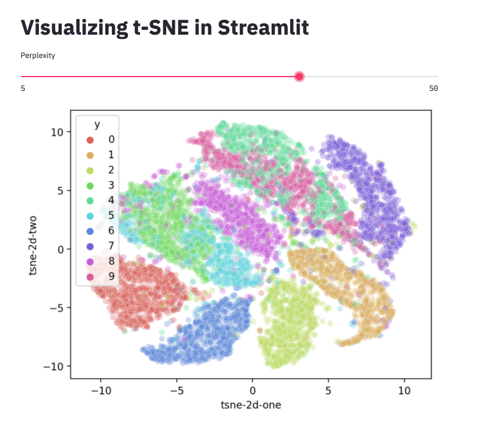

# Data Application example using Steamlit

[Streamlit](https://www.streamlit.io/) is an open source framework for building a Data Visualization webapp in Python.   

Streamlit is not yet another charting software.  Rather, it is an easy to use library for building (or converting your exisitng Python code) an interactive web page by adding layouts and widgets around the charts you plot.  The charting can be done with anything from matplotlib to plotly to seaborn.  

## t-SNE visualization demo

To try out Streamlit, I wrote a Streamlit app that displays t-SNE results using different perplexity.  This is a simple and common demo that takes 10000 random samples from MNIST data, then run t_SNE on it to visualize different clusters of handwritten digits in 2D space.

One thing to note is that Streamlit is not a data exploration tool. Rather, Streamlit is a curated data presentation tool. So in this example, the t-SNE data is pre-generated (generate_tsne.py), and the DataApp merely selects which dataset to display depending on the slider input.

To run, 

`streamlit run streamlit_tsne.py`

and you'll see a screen like below.

---

Streamlit can do quite a bit more, but it is also very easy to just start using.  Converting an existing Python code to Streamlit takes matter of minutes.  